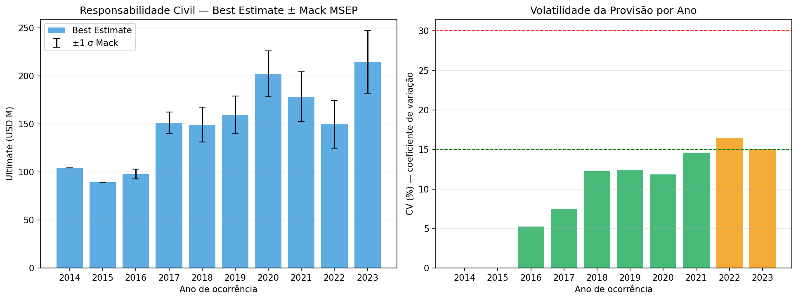
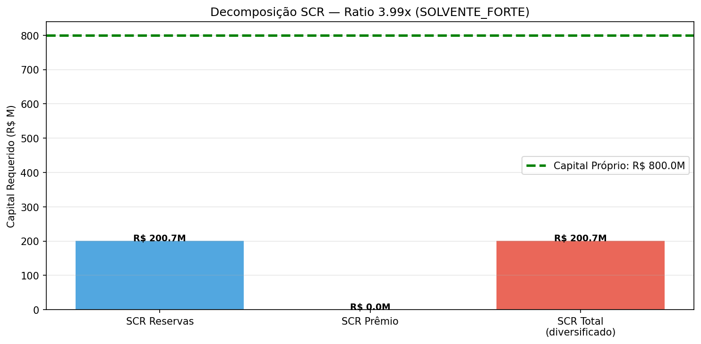
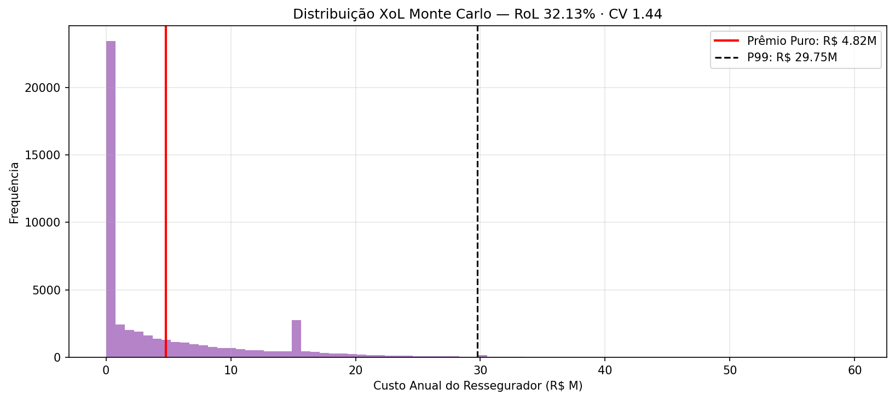

# Relatório do Conselho — Responsabilidade Civil

## Recomendação: ✅ **Aprovar Best Estimate**

- SCR Ratio = 3.99x ≥ 2.0 (capital robusto)
- CV do IBNR = 9.8% ≤ 15% (provisão estável)

---

## 1. Provisão Técnica (Mack Stochastic CL)

| Métrica | Valor |
|---|---|
| Best Estimate (E[IBNR]) | R$ 712.95M |
| MSEP (raiz quadrada) | R$ 61.47M |
| Coeficiente de Variação | 9.8% |
| Quantil 75 (provisão prudente) | R$ 664.33M |
| Quantil 99.5 (Solvência II) | R$ 800.63M |
| Tail Factor estimado | 1.0589 |

## 2. Precificação 2025

| Métrica | Valor |
|---|---|
| Trend Factor inflacionário | 1.1266 |
| Burning Cost médio | R$ 5.71K |
| Prêmio Puro | R$ 0.01M |
| Loading | 25% |
| Prêmio Comercial | R$ 0.01M |

## 3. Solvência II (Susep)

| Componente | Valor |
|---|---|
| Best Estimate | R$ 712.95M |
| Risk Margin (CoC 6%) | R$ 6.41M |
| SCR Reservas | R$ 200.68M |
| SCR Prêmio | R$ 0.01M |
| **SCR Total (diversificado)** | **R$ 200.69M** |
| Capital Próprio | R$ 800.00M |
| **SCR Ratio** | **3.99x** (SOLVENTE_FORTE) |

## 4. Resseguro XoL — Sugestão de Compra

Tratado de Excess of Loss para proteção de tail risk de large losses.

| Métrica | Valor |
|---|---|
| Frequência large losses esperada | 0.89/ano |
| Prêmio puro do tratado | R$ 4.82M |
| Rate on Line | 32.13% |
| CV anual do custo | 1.44 |
| Pior ano simulado | R$ 59.60M |

---

## Critérios da decisão

| Decisão | Critério |
|---|---|
| ✅ APROVAR Best Estimate | SCR ≥ 2.0x **E** CV ≤ 15% |
| ⚠️ Provisionar no Q75 | CV > 30% (provisão volátil) |
| ❌ Intervenção | SCR Ratio < 1.0x |

## Metodologia

- **Chain Ladder Determinístico (Mack 1993)**: link-ratios ponderados por volume.
- **MSEP**: σ²_k = (1/(I-k-1)) Σ C_{i,k}·(C_{i,k+1}/C_{i,k} - f_k)². Quantis 75/99.5 via aproximação log-normal.
- **SCR**: SCR_total = √(SCR_res² + SCR_pre² + 2·0.5·SCR_res·SCR_pre) (correlação Susep).
- **XoL Pricing**: Monte Carlo com 50.000 anos, frequência Poisson + severidade LogNormal.